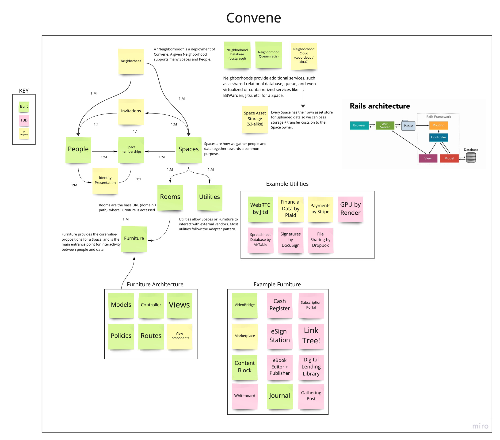

- [1. Getting Oriented.](#1-getting-oriented)
  - [1.1. Architecture](#11-architecture)
  - [1.2. Design](#12-design)
- [2. Machine Setup.](#2-machine-setup)
  - [2.1. Developer Setup and Documentation.](#21-developer-setup-and-documentation)
  - [2.2. Infrastructure Setup and Documentation.](#22-infrastructure-setup-and-documentation)
  - [2.3. Using the devcontainer.](#23-using-the-devcontainer)

## 1. Getting Oriented.

We're currently working towards our
[1.0 Andromeda Release](https://github.com/zinc-collective/convene/milestone/1).
The issues in the milestone are ordered by rough priority.

Each issue labeled `epic` is pretty big. We tend to use checkboxes to decompose
big issues into smaller pieces of work for people to bite off. We don't expect
contributors to complete all the work before submitting their first patch.
Instead, we prefer Contributors to take little bites and submit small patches so
that we can develop tight, asynchronous feedback loops.

We use labels like `design`, `documentation`, `test`, `code`, `infrastructure`,
and `security` to indicate what kind of work is remaining on the issue.

We tend to “merge quickly and often” so long as the patch is safe to apply. If
you prefer your patch not get merged, please mark the
[PR as a draft](https://docs.github.com/en/free-pro-team@latest/github/collaborating-with-issues-and-pull-requests/about-pull-requests#draft-pull-requests).

New contributors may want to review
[the Zinc contribution guide](https://www.zinc.coop/contributing/) for an
overview of the norms we follow across projects.

### 1.1. Architecture

At present, Convene is split into three modules:

The root directory provides the human and programmatic interface for Convene
as well as data-persistence; with two additional submodules.

- `infrastructure`, which contains infrastructure management code for Packer,
  Terraform and Ansible.
- `features`, which includes the high-level test definitions for the Convene
  experience.

#### Architecture Overview

_Last updated: Dec 2022_



Original on Miro: https://miro.com/app/board/o9J_lLrbz1g=/

#### ERD


Generate an updated ERD via:
```bash
bin/erd
```

### 1.2. Design

We encourage everyone to read the
[Convene Experience Brief](https://docs.google.com/document/d/1cqnQa3NhRxY1gkGekGokeuXKTxS9oMGm3fH1cNasYOo/edit?usp=drive_web&ouid=109885491663234077023)
to orient themselves on our target emotional and experience design.

We have a
[set of Personas and a Glossary](https://docs.google.com/spreadsheets/d/1BOBCT0yrgrbCuQFTx_hIQak0FSQjnjjFZVA3YksEv8s/edit#gid=622652343)
that guide our design and development.

We also have a
[set of inspirational Wireframes](https://xd.adobe.com/view/fd425dbe-5384-44c9-997a-eeee6e886a86-a811/grid).

Designers who have agreed to protect the privacy of our clients may access our
[Customer Research Interviews](https://drive.google.com/drive/u/2/folders/1gncYSkVIAj4CnlUZM9KPQlFdj_aqulDl)

## 2. Machine Setup.

### 2.1. Developer Setup and Documentation.

To set up your development environment you'll need `ruby`, `node` and
`postgresql`. If on Windows using WSL2, please see [this document](docs/windows-wsl-dev-setup.md).

First, ensure your development environment has:

1. Ruby (See [.ruby-version](./.ruby-version) for version)
2. Node (See [.nvmrc](./.nvmrc) for version)
3. [Yarn]
4. [PostgreSQL]. (Note: For people using [Docker], a [docker-compose.yml]
   file has been included for convenience.)

Then, run `bin/setup` to install Ruby and Node dependencies and set up the
database.

Once setup completes, configure your local development environment.
1. Copy `.env.sample` to `.env`
1. Update variables in `.env` as needed

Once you have completed configuration; run `bin/run`. You now should be able to open
http://localhost:3000 and see Convene.

Log in with space-member@example.com. You can check the email using http://localhost:1080.

Finally, with the server still running (perhaps in a different terminal), run
`bin/test` to ensure that your development environment is configured correctly.

[PostgreSQL 12]: https://www.postgresql.org/download/
[Docker]: https://www.docker.com
[docker-compose.yml]: ./docker-compose.yml
[.env.example]: ./.env.example
[Yarn]: https://yarnpkg.com/getting-started/install

### 2.2. Infrastructure Setup and Documentation.

Infrastructure engineers may want to look at the
[`infrastructure` module's `README`](./infrastructure/README.md), which includes
how to configure your local machine or a virtual machine as a video bridge host.

### 2.3. Using the devcontainer.
We have setup a developer container environment using VS Code's Dev Containers extension. 
Please see [this document](docs/devcontainer-usage.md) for instructions on using.
