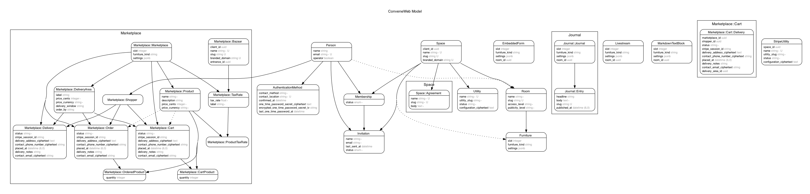

- [1. Getting Oriented.](#1-getting-oriented)
  - [1.1 General Design and Architecture.](#11-general-design-and-architecture)
  - [1.2 Users and Stakeholders.](#12-users-and-stakeholders)
  - [1.3 Specific Dependencies](#13-specific-dependencies)
  - [1.4 Entity Relationship Diagram (ERD).](#14-entity-relationship-diagram-erd)
- [2. Machine Setup.](#2-machine-setup)
  - [2.1. Developer Setup and Documentation.](#21-developer-setup-and-documentation)
  - [2.2.1 Developing Mailers.](#221-developing-mailers)
  - [2.2.2 Debugger](#222-debugger)
  - [2.3. Using the devcontainer.](#23-using-the-devcontainer)
  - [2.4. Testing](#24-testing)

## 1. Getting Oriented.

New contributors may want to review
[the Zinc contribution guide](https://www.zinc.coop/contributing/) to ground themselves in the norms we try to follow across projects.

### 1.1 General Design and Architecture.
[`Convene`] is as a multi-user, multi-application web-first Operating System.

Convene's design strategy leans heavily into [Outcome-Driven Innovation](https://en.wikipedia.org/wiki/Outcome-Driven_Innovation), [Accessibility](https://developer.mozilla.org/en-US/docs/Web/Accessibility), [Usability](https://en.wikipedia.org/wiki/Usability), and [Data Portability](https://en.wikipedia.org/wiki/Data_portability).
Interoperability is offered by embracing open protocols like [Hypermedia as the Engine of Application State (HATEOAS)](https://en.wikipedia.org/wiki/HATEOAS). Quality and Changeability is maintained by performing [Test-Oriented Development](https://en.wikipedia.org/wiki/Test-driven_development), [Continuous Deployment](https://en.wikipedia.org/wiki/Continuous_deployment), and [Domain Driven Design](https://en.wikipedia.org/wiki/Domain-driven_design).


### 1.2 Users and Stakeholders.
Stakeholders for `Convene` fall into one or more of the following categories:

- [`Clients`], who are the legal owners of the data of their [`Spaces`] in a [`Neighborhood`].
- [`Members`], have broad authority over [`Spaces`] and their [`Furniture`]. They are also responsible for [`Visitor`: Support], [`Visitor`: Trust & Safety], [`Member`: Support], and [`Member`: Trust & Safety].
- [`Visitors`], who access [`Spaces`] and their [`Furniture`] according to [`Member`] specification.
- [`Operators`], who steward the [`Neighborhood`: Infrastructure], [`Neighborhood`: Trust & Safety], and [`Client`: Support] responsibilities
- [`Contributors`] and [`Maintainers`], who design and build [`Furniture`].

Note: `Furniture` has been renamed to `Gizmo/Gizmos`.

### 1.3 Specific Dependencies

#### 1.3.a. Upstream Dependencies

Contributing to Convene benefits from fluency with the following tools:

- For Data Storage and Retrieval: [PostgreSQL], [Redis], and an [S3-compatible] file store.
- Servicing HTTP Requests is done with [Ruby on Rails].
- Background Jobs are performed by [Sidekiq].
- The User Interface is Server-Side Rendered [`Components`] implemented using [ViewComponent] styled by [Tailwind] and with interactivity provided by [Turbo] and [StimulusJS].
### 1.4 Entity Relationship Diagram (ERD).

We auto-generate an ERD from our Domain Model.



Generate an updated ERD via:
```bash
bin/erd
```

## 2. Machine Setup.

### 2.1. Developer Setup and Documentation.

To set up your development environment you'll need `ruby`, `node` and
`postgresql`. If on Windows using WSL2, please see [this document](docs/windows-wsl-dev-setup.md).

First, ensure your development environment has:

1. Ruby (See [.ruby-version](./.ruby-version) for version)
2. Node (See [.nvmrc](./.nvmrc) for version)
3. [Yarn]
4. [PostgreSQL]
5. [Redis]

(Note: If you use [Docker], a [docker-compose.yml] file has been included with
  [PostgreSQL] and [Redis] for convenience.)

Then, run `bin/setup` to install Ruby and Node dependencies and set up the
database.

Once setup completes, configure your local development environment.
1. Open `.env` and make any changes.

Once you have completed configuration; run `bin/run`. You now should be able to open
http://localhost:3000 and see Convene.

Log in with space-member@example.com. You can check the email using http://localhost:1080.

Finally, with the server still running (perhaps in a different terminal), run
`bin/test` to ensure that your development environment is configured correctly.

[PostgreSQL]: https://www.postgresql.org/
[Redis]: https://redis.io/
[Docker]: https://www.docker.com
[docker-compose.yml]: ./docker-compose.yml
[.env.development.example]: ./.env.development.example
[Yarn]: https://yarnpkg.com/getting-started/install

### 2.2.1 Developing Mailers.

Set [SMTP\_\* environment variables to configure Action Mailer](.env.development.example).

To preview mailers, visit http://localhost:3000/rails/mailers/

For more information about Rails's ActionMailers, see [this guide](https://guides.rubyonrails.org/action_mailer_basics.html).

### 2.2.2 Debugger

To run `pry` or `byebug`, run `bin/connect web`.

Guides: [`pry`](http://pry.github.io/) |  [`byebug`](https://github.com/deivid-rodriguez/byebug/blob/master/GUIDE.md)

### 2.3. Using the devcontainer.
We have setup a developer container environment using VS Code's Dev Containers extension.
Please see [this document](docs/devcontainer-usage.md) for instructions on using.

### 2.4. Testing
See the [Testing documentation](docs/testing.md).

[`Clients`]: https://github.com/zinc-collective/convene/issues/1475
[`Convene`]: https://github.com/zinc-collective/convene
[`Operators`]: https://github.com/zinc-collective/convene/issues/103
[`Neighborhood`]: https://github.com/zinc-collective/convene/issues/892
[`Neighborhoods`]: https://github.com/zinc-collective/convene/issues/892
[`Space`]: https://github.com/zinc-collective/convene/issues/1154
[`Spaces`]: https://github.com/zinc-collective/convene/issues/1154
