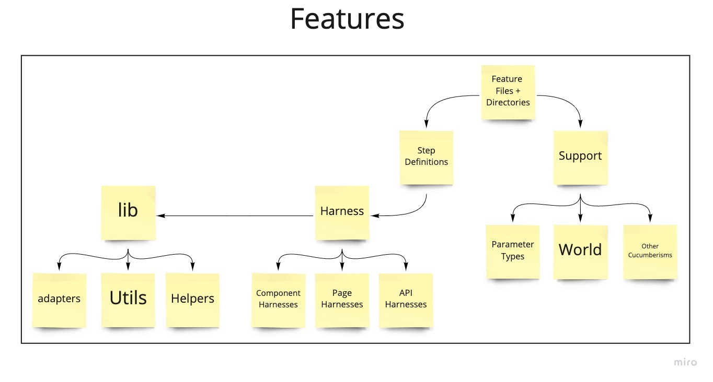

# Convene <!-- omit in toc -->

Convene secure, affordable, always-available digital Spaces where anyone can
(play || work || grow || be). 🎲 👩‍💻 🌱 🛋️

- [Overview](#overview)
- [Using Convene](#using-convene)
  - [Purchasing a Convene Operator License.](#purchasing-a-convene-operator-license)
  - [Help and Support](#help-and-support)
- [Contributing to Convene](#contributing-to-convene)
- [System Overview](#system-overview)
  - [Architecture overview diagram](#architecture-overview-diagram)
- [Configuring Your Development Machine](#configuring-your-development-machine)
  - [Debugger](#debugger)
  - [Developing Mailers](#developing-mailers)
- [Testing Convene](#testing-convene)
  - [Overview of the `features` folder](#overview-of-the-features-folder)
- [About The Zinc Collective](#about-the-zinc-collective)

## Overview

Convene is an _Operating System_ for **Community Owned Digital Infrastructure**.
Once deployed to a server, Convene is accessed by any web browser.

Convene serves as a community-owned, more ethical alternative to investor-owned online tools like
SquareSpace, Etsy, Patreon, Zoom, Yelp, and more.

A Convene Deployment is a _Neighborhood_. People create _Spaces_ in a _Neighborhood_, and fill those _Spaces_
with _Furniture_ to meet their collective digital needs. For example:

- A Regional Co-operative network could provide their members with shared payments and video communication infrastructure.
- A Farmer's Market could provide professionally designed websites and social media presences for their vendors.
- A Co-operative Startup Incubator could keep capitalization tables, Patronage Records and other logistical records.

You can see more in the [Zinc neighborhood](https://convene.zinc.coop).

We have two milestones we are working towards:

- Product Milestone:
  [1.0 Andromeda](https://github.com/zinc-collective/convene/milestone/1)
- Engineering Milestone:
  [Cleanup!](https://github.com/zinc-collective/convene/milestone/3)

## Using Convene

[Zinc] maintains a Convene Neighborhood at https://convene.zinc.coop. For people
who want to run their own Neighborhood of Spaces, consider purchasing a Convene
Operator License.

[zinc]: https://www.zinc.coop/

### Purchasing a Convene Operator License.

Individuals and non-commercial organizations may run their own Convene
deployment however they see fit without requiring payment.

However, if the person or organization engages in commerce, defined as taking
currency in exchange for goods or services, then the organization must purchase
a license to use Convene.

Pricing is determined on a case-by-case basis. Please reach out to
[`hello@zinc.coop`](mailto:hello@zinc.coop) for licensing information.

### Help and Support

Organizations and individuals who are comfortable relying on free Community
Support are encouraged to [start a discussion][discussions]. Maintainers
respond as they are available.

Paid support is available for \$135 USD per hour[1][footnote-1].

[prosperity public license]: https://prosperitylicense.com/
[issue-tracker]: https://github.com/zinc-collective/convene/issues
[discussions]: https://github.com/zinc-collective/convene/discussions

## Contributing to Convene

We're always excited for new contributors! Read more in our
[guide to contributing, located in CONTRIBUTING.md](./CONTRIBUTING.md)

## System Overview

The central piece of Convene is a Ruby on Rails server that is responsible for:

- serving the Convene UI
- managing users, spaces, rooms, permissions, etc

This [high level view of our design](https://docs.google.com/spreadsheets/d/1BOBCT0yrgrbCuQFTx_hIQak0FSQjnjjFZVA3YksEv8s/edit#gid=622652343)
shows the personas and segments we are focusing on initially with
Convene. It also includes our current vision of the types of spaces, rooms and participants it
serves and clarifies the design of privacy permissions.

The Convene UI is based on Rails standard templating system, with heavy use of:

- [Stimulus JS](https://stimulusjs.org/)
  - the entry point for our JavaScript is in `app/javascript/controllers/index.js`,
    which loads all `app/javascript/*_controllers.js` files
- [Tailwind CSS](https://tailwindcss.com/) to help speed up making good-looking UIs

Jitsi is Convene's video call infrastructure. The
[video_room_controller.js](./app/javascript/controllers/video_room_controller.js) is the entry point
where we load a Jitsi video call iframe into Convene's UI.

If you want to run Jitsi locally, see the configuration provided in
[`infrastructure/jitsi-meet-local`](./infrastructure/jitsi-meet-local/README.md).

### Architecture overview diagram

_Last updated: Dec 2022_

Original on Miro: https://miro.com/app/board/o9J_lLrbz1g=/

## Configuring Your Development Machine

See [Developer setup and documentation](./CONTRIBUTING.md#2-machine-setup).

### Debugger

To run `pry` or `byebug`, run `bin/connect web`.

### Developing Mailers

Set [SMTP\_\* environment variables to configure Action Mailer](.env.example).

To preview mailers, visit http://localhost:3000/rails/mailers/

## Testing Convene

The Convene interface is tested in two ways:

1. Open-box unit and integration tests, which are defined in the
   [`spec` folder](./spec)
2. Closed-box story tests, which are defined in the top level
   [`features` folder](./features)

Many enhancements and fixes can be made without updating the story tests, while
almost all changes will want updated unit or integration tests.

For story tests, we use [Cucumber] to encourage us to write tests as
human-friendly documentation.

For unit and integration tests, we use [RSpec]. RSpec is a nice complement to
Cucumber, in that it allows us to directly integrate with the underlying Ruby
and Rails code without writing human or computer interfaces that require
inter-process communication.

This helps us write small, focused tests that deal with 1~3 Ruby classes instead
of having to spin up a working instance of the entire application.

Tests that need database access should `require "rails_helper"`, and tests that
can be executed without a database should `require "spec_helper"`.

### Overview of the `features` folder

_Last updated: April 2021_

Original on Miro: https://miro.com/app/board/o9J_lLrbz1g=/

[rspec]: https://rspec.info/
[cucumber]: https://cucumber.io/

## About The Zinc Collective

Convene is maintained by a dedicated community of volunteer Contributors and
Maintainers known as the [Zinc Collective], a digital product and services
cooperative.

We have a [Pledge and Code of Conduct](https://www.zinc.coop/code-of-conduct/).
And anyone can become a [contributor](https://www.zinc.coop/contributing/)
and/or [maintainer](https://www.zinc.coop/maintaining/).

[zinc collective]: https://www.zinc.coop/

## Footnotes <!-- omit in toc -->

### Paid Support <!-- omit in toc -->

Our paid support rate is pegged to 3x [the San Francisco Living Wage for a
couple with a single worker raising three children][san-francisco-living-wage].

This rate is negotiable for organizations that offer Zinc a [patronage
account][what-is-patronage] or corresponding equity stake.

Paid support clients may also request a deferred payment program, with terms to
be determined on a case-by-case basis.

[footnote-1]: #paid-support
[san-francisco-living-wage]: https://livingwage.mit.edu/metros/41860
[what-is-patronage]: https://www.co-oplaw.org/finances-tax/patronage/#How_Patronage_Works
