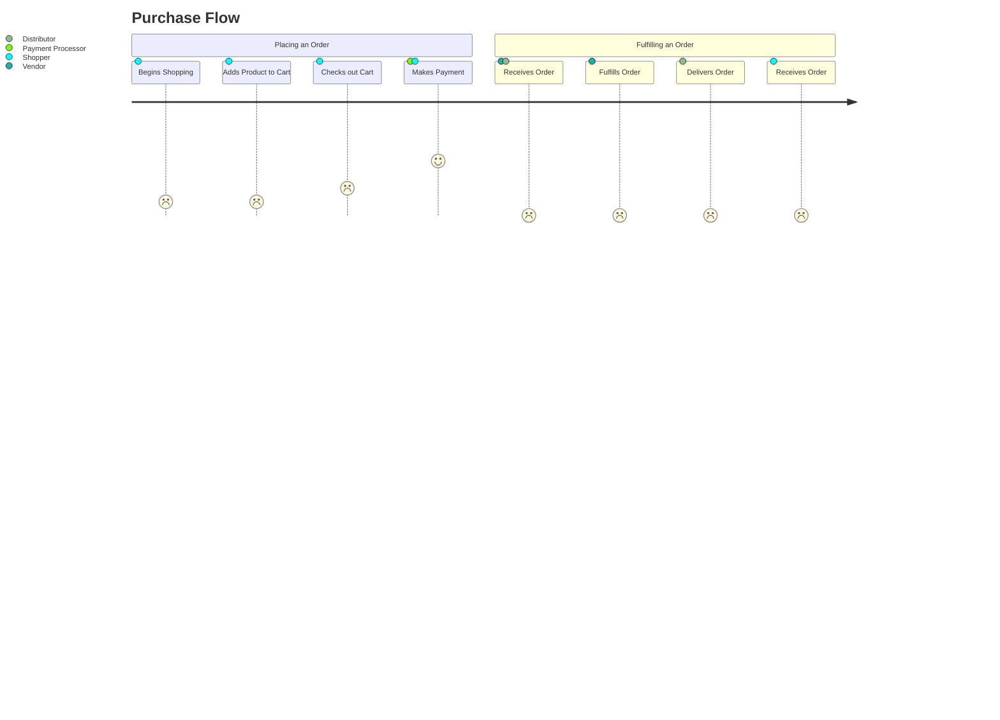
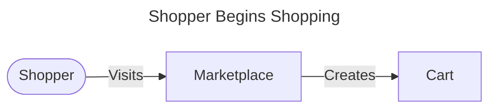
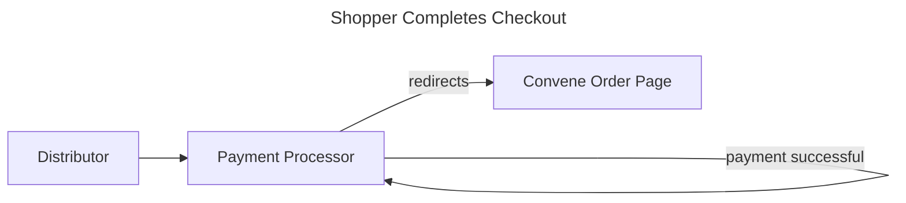

# Marketplace

## Human/Computer/Human Interaction Design

1. `Shopper` links `Product`s to their `Cart` by creating a `CartProduct` record which keeps track of things like quantity, discounts, special requests, etc.

2. `Shopper` creates a `Checkout`, which directs them to the `Distributor`'s Payment Processor (Stripe, for now).

3. `Shopper` completes the Payment Processor's flow, which directs them back to Convene and updates the `Checkout` with payment processor details.

4. `Shopper` is redirected to the `Order`, which represents the `Cart` to the `Shopper` in a read-only manner.

## Architecture

The Marketplace uses Stripe, we anticipate that we will want to use the "Connect then Transfer" workflow: https://stripe.com/docs/connect/collect-then-transfer-guide

1. Build the Workflow for connecting a Stripe Account
2. Checkout with Stripe Checkout, and include the payment_intent_data with a transfer_group: https://stripe.com/docs/api/checkout/sessions/create#create_checkout_session-payment_intent_data-transfer_group
3. Upon completion of Checkout, we transfer the Money: https://stripe.com/docs/connect/charges-transfers

## Testing with Stripe

Stripe provides test API keys and testing credit card numbers, see:
* https://stripe.com/docs/keys#obtain-api-keys
* https://stripe.com/docs/testing
