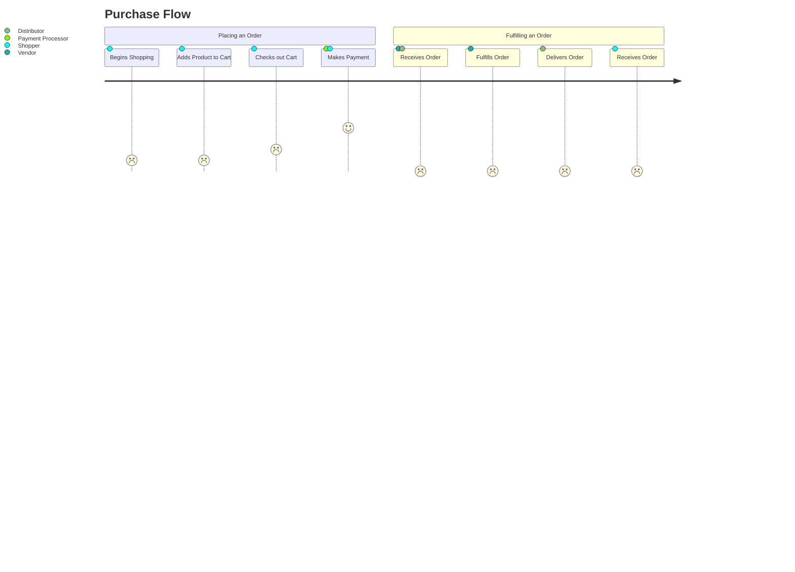
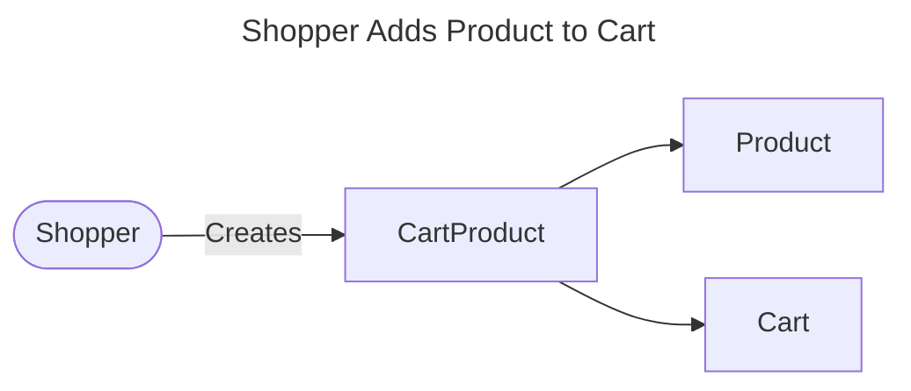
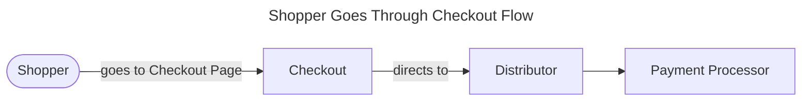
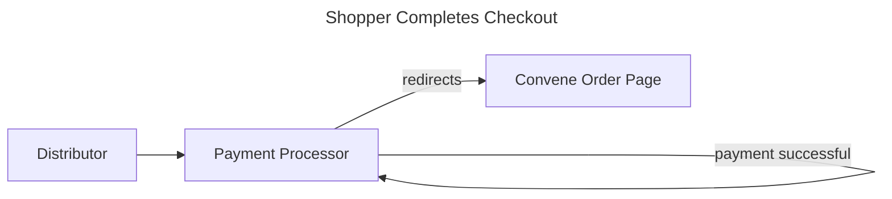

# Marketplace

## Human/Computer/Human Interaction Design

1. `Shopper` links `Product`s to their `Cart` by creating a `CartProduct` record which keeps track of things like quantity, discounts, special requests, etc.

2. `Shopper` creates a `Checkout`, which directs them to the `Distributor`'s Payment Processor (Stripe, for now).

3. `Shopper` completes the Payment Processor's flow, which directs them back to Convene and updates the `Checkout` with payment processor details.

4. `Shopper` is redirected to the `Order`, which represents the `Cart` to the `Shopper` in a read-only manner.

## Architecture

The Marketplace uses Stripe for online payments. Developers should use the ["Connect then Transfer" workflow](https://stripe.com/docs/connect/collect-then-transfer-guide) as a guide to the overall architectural pattern. At a high level, implementing this pattern boils down to three areas of concern:

1. Build the Workflow for connecting a Stripe Account
  - Currently implemented for Space administrators with a "Connect to Stripe" button
2. Checkout with Stripe Checkout, and include the `payment_intent_data` with a `transfer_group`: https://stripe.com/docs/api/checkout/sessions/create#create_checkout_session-payment_intent_data-transfer_group
3. Upon completion of Checkout, we transfer the Money: https://stripe.com/docs/connect/charges-transfers

## Testing with Stripe

Stripe provides a host of tools for developers to build and test integrations with their own applications. But deciding how to take advantage of these tools in your own development process is less straight forward. If you're totally new to Stripe, make sure to generally familiarize yourself with Stripe's test capabilities. You might start by reading or scanning these docs start to finish:
* [Developer tools](https://stripe.com/docs/development)
* [Testing](https://stripe.com/docs/testing)

### Webhooks
Almost every application integrating with a payment provider will require some form of bi-directional communication, and an architectural pattern that can handle asynchronous actions or events that occur on the provider's side. Even at their most basic, payment workflows between two systems get complicated fast. Rather than forcing you to proactively poll their system for updates, Stripe supports custom webhooks in your own application to monitor and receive messages. Our Marketplace gizmo uses Stripe webhooks, so make sure to familiarize yourself with how events and webhooks work at Stripe.
* [Use incoming webhooks to get real-time updates](https://stripe.com/docs/webhooks)
* [Stripe webhook events overview](https://stripe.com/docs/webhooks/stripe-events)
* [Test a webhooks integration with the Stripe CLI](https://stripe.com/docs/webhooks/test)

### Building and testing Stripe locally

See [Working With Stripe Locally](docs/working-with-stripe-locally.md)

### On Github CodeSpaces
If you are using a Github CodeSpace, you will want to mark the web-server port as `public` so that Stripe can send it events.
