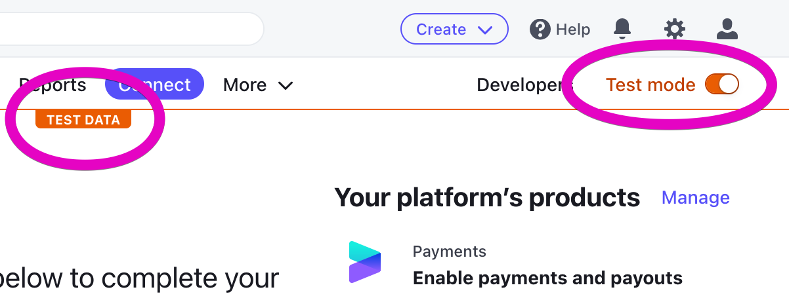
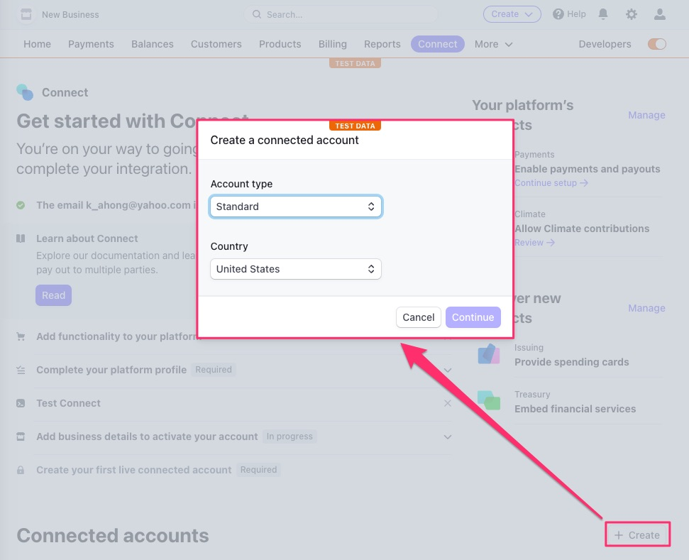

# Webhooks
Almost every application integrating with a payment provider will require some form of bi-directional communication, and an architectural pattern that can handle asynchronous actions or events that occur on the provider's side. Even at their most basic, payment workflows between two systems get complicated fast. Rather than forcing you to proactively poll their system for updates, Stripe supports custom webhooks in your own application to monitor and receive messages. Our Marketplace gizmo uses Stripe webhooks, so make sure to familiarize yourself with how events and webhooks work at Stripe.
* [Use incoming webhooks to get real-time updates](https://stripe.com/docs/webhooks)
* [Stripe webhook events overview](https://stripe.com/docs/webhooks/stripe-events)
* [Test a webhooks integration with the Stripe CLI](https://stripe.com/docs/webhooks/test)

# Setting up your local environment

Since Marketplace already implements Stripe with custom webhook endpoints, developers will only need to setup the tooling to build and test against the existing code.

## Create a Stripe account and connect a Marketplace

These instructions assume you don't already have a Stripe account. Developers who are familiar with Stripe and have developed with Stripe may skip steps as appropriate.

First, let's create and configure a Stripe account for testing:
1. [Sign up](https://dashboard.stripe.com/register)
  - Consider using a different email from your personal email. Eg, `my.name+stripedev@gmail.com`.
  - Since you will only be using Stripe to test, you won't have to pay anything
1. When logged into your Stripe account, turn on `Test mode` in the top right of the dashboard.
  

For the "Connect to Stripe" flow to work, you will need to have a local development URL that is recognized by Stripe as "reachable". One way to do this is:
1. Add `127.0.0.1 convene.local` to your `/etc/hosts`
1. Access the app locally through `convene.local:3000`, instead of `localhost`
1. Optionally, add `convene.local` as the `branded_domain` to whatever Space you are using for testing, to shorten the URL you use to access it

Next, add your secret API key:
1. Click on the `Developers` button next to `Test mode` in the top right of your Stripe dasbhoard
1. Find your `Secret key` and copy it
1. Paste the key into `Api token` field on your Stripe Utility settings page
  - `http://convene.local:3000/spaces/<space_name>/utilities/<utiltiy_id>/edit`

Next, using the stripe cli, configure Stripe to forward events to your local environment by obtainining a webhook secret key:

1. Install [`stripe` cli](https://stripe.com/docs/stripe-cli) if you haven't already
1. Find the `--foward-to` url for your marketplace by printing the value of  `polymorphic_url(marketplace.location(child: :stripe_events))` from within a controller or view debug session
  - E.g. from view: `<%= debug polymorphic_url(marketplace.location(child: :stripe_events)) %>`
  - [Read more](https://stripe.com/docs/webhooks/test#webhook-test-cli)
1. Set stripe event forwarding to this url by executing: `$ stripe listen --forward-to <YOUR_FORWARD_TO_URL>`
1. Copy the webhook signing secret from the output. The output from the above command should look something like:
```
> Ready! You are using Stripe API Version [2022-11-15]. Your webhook signing secret is whsec_***** (^C to quit)
```
1. Update the marketplace settings directly in the database by adding the `stripe_webhook_endpoint_secret` to `public.furnitures.settings`

Finally, let's connect!

1. First, create a Connected account within Stripe by visiting [https://dashboard.stripe.com/test/connect/accounts/overview](https://dashboard.stripe.com/test/connect/accounts/overview) and clicking the `+ Create` button in the "Connected accounts" section.
  
  - You might name this account something like `<Space_Name> Dev`
  - [Learn more](https://stripe.com/docs/connect)
1. Follow the UI prompost for creating a `Standard account`
1. Once your new Connected account is setup, go back into the app, visit `http://convene.local:3000/spaces/<space_name>/rooms/store/marketplaces/<furniture_id>/edit` and click the `Connect to Stripe` button
1. Verify that you see the `Stripe Connected!` success message on the page