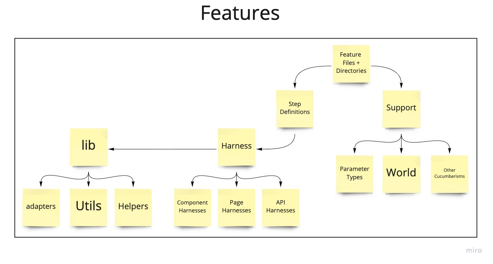

# Convene Web <!-- omit in toc -->

- [Contributing](#contributing)
- [System Overview](#system-overview)
  - [Architecture overview diagram](#architecture-overview-diagram)
- [Configuring Your Development Machine](#configuring-your-development-machine)
  - [Debugger](#debugger)
  - [Developing Mailers](#developing-mailers)
- [Testing Convene Web](#testing-convene-web)
  - [Overview of the `features` folder](#overview-of-the-features-folder)

The Convene Web project provides a human and computer interface for managing of
Spaces, Rooms, and Team Members.

The User Interface is written in [Stimulus](https://stimulusjs.org/).

## Contributing

See [Convene's Contributing Guide](../CONTRIBUTING.md) for an overview of
contributing to Zinc projects.

## System Overview

The central piece to Convene is `convene-web`, a Ruby on Rails server that is responsible for:
* serving the Convene UI
* managing users, spaces, rooms, permissions, etc

This [high level view of our design](https://docs.google.com/spreadsheets/d/1BOBCT0yrgrbCuQFTx_hIQak0FSQjnjjFZVA3YksEv8s/edit#gid=622652343)
shows the personas and segments we are focusing on initially with
Convene. It also includes our current vision of the types of spaces, rooms and participants it
serves and clarifies the design of privacy permissions.

The Convene UI is based on Rails standard templating system, with heavy use of:
* [Stimulus JS](https://stimulusjs.org/)
   * the entry point for our JavaScript is in `app/javascript/controllers/index.js`,
     which loads all `app/javascript/*_controllers.js` files
* [Tailwind CSS](https://tailwindcss.com/) to help speed up making good-looking UIs

Jitsi is Convene's video call infrastructure. The
[video_room_controller.js](./app/javascript/controllers/video_room_controller.js) is the entry point
where we load a Jitsi video call iframe into Convene's UI.

If you want to run Jitsi locally, see the configuration provided in
[`infrastructure/jitsi-meet-local`](../infrastructure/jitsi-meet-local/README.md).

### Architecture overview diagram
_Last updated: April 2021_

Original on Miro:  https://miro.com/app/board/o9J_lLrbz1g=/

## Configuring Your Development Machine
See [Developer setup and documentation](../CONTRIBUTING.md#2-machine-setup).

### Debugger

To run `pry` or `byebug`, run `bin/connect web`.

### Developing Mailers

Set [SMTP_* environment variables to configure Action Mailer](.env.example).

To preview mailers, visit http://localhost:3000/rails/mailers/

## Testing Convene Web

The Convene Web interface is tested in two ways:

1. Open-box unit and integration tests, which are defined in the
   [`convene-web/spec` folder](./spec)
2. Closed-box story tests, which are defined in the top level
   [`features` folder](../features)

Many enhancements and fixes can be made without updating the story tests, while
almost all changes will want updated unit or integration tests.

For story tests, we use [Cucumber] to encourage us to write tests as
human-friendly documentation.

For unit and integration tests, we use [RSpec]. RSpec is a nice complement to
Cucumber, in that it allows us to directly integrate with the underlying Ruby
and Rails code without writing human or computer interfaces that require
inter-process communication.

This helps us write small, focused tests that deal with 1~3 Ruby classes instead
of having to spin up a working instance of the entire application.

Tests that need database access should `require "rails_helper"`, and tests that
can be executed without a database should `require "spec_helper"`.

### Overview of the `features` folder
_Last updated: April 2021_

Original on Miro:  https://miro.com/app/board/o9J_lLrbz1g=/

[rspec]: https://rspec.info/
[cucumber]: https://cucumber.io/
