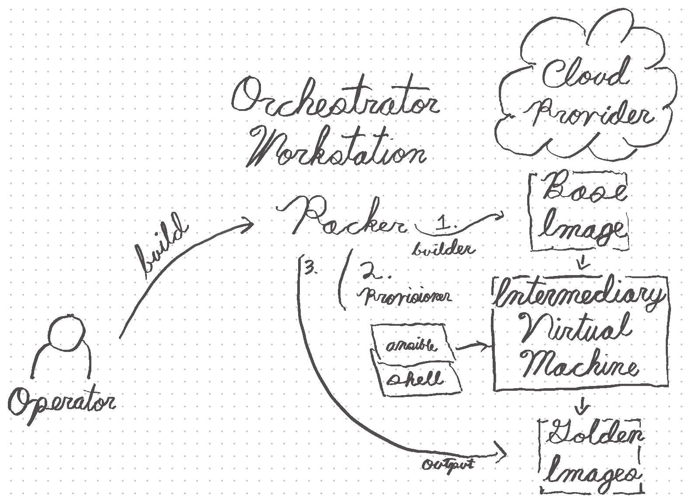

# Convene::Infrastructure

Tools to manage the infrastructure for Convene clients.

## Usage

See documentation in the `features` directory to learn how to run the commands
that provision client infrastructure.

Convene::Infrastructure uses the following tools to ensure broad
interoperability between infrastructure providers.

- [Packer](https://www.packer.io/intro/getting-started/)
- [Terraform](https://learn.hashicorp.com/terraform/getting-started/install.html)
- [Ansible](https://www.ansible.com/resources/get-started)

Please ensure all three are installed and run from your command line.

### Creating Your Own Convene Workspace

There are two steps to creating a Convene Video Workspace:

1. [Building a Workspace's Blueprint](#building-a-workspaces-blueprint)
1. [Provisioning a Workspace from the Blueprint](#provisioning-a-workspace-from-the-blueprint)

Every Convene Video Workspace has a _Blueprint_. Blueprints define:

1. The Infrastructure provider(s) your Workspace will run on.
2. The Workspace's security, reliability, and performance configuration
   specification.
3. The [golden image(s)] that will be placed within the Infrastructure provider
   when provisioned.

Each Blueprint includes the following files:

- `infrastructure.tf`: Terraform file configuring the infrastructure.
- `public.tfvars`: Variables that are safe to share with the world.
- `secrets.tfvars`: API credentials or other variables that are not safe to save
  to the repository. `.gitignore`d by default.

There are example Blueprints for:

- [Amazon Web Services], [in `clients/convene-test-aws.zinc.coop`]
- [Vultr], [in `clients/convene-test-vultr.zinc.coop`]

[in `clients/convene-test-aws.zinc.coop`]: ./clients/convene-test-aws.zinc.coop
[in `clients/convene-test-vultr.zinc.coop`]:
  ./clients/convene-test-vultr.zinc.coop
[amazon web services]: https://aws.amazon.com/
[vultr]: https://www.vultr.com/
[golden image(s)]: https://www.quora.com/What-is-golden-image

#### Building a Workspace's Blueprint

For step-by-step instructions for building a Workspace, see the "Operator
builds..." scenarios in [`features/video-workspaces.feature`].

A visual overview of what happens when an Operator builds a Blueprint is as
follows:

[`features/video-workspaces.feature`]: ./features/video-workspaces.feature

#### Provisioning a Workspace from the Blueprint

For step-by-step instructions for building a Workspace, see the "Operator
Provisions..." scenarios in [`features/video-workspaces.feature`].
